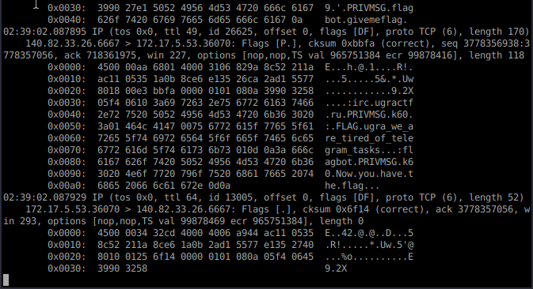
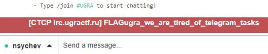

# Елеграм: Write-up

## Суть

Здесь нам предлагалось подключиться к серверу по протоколу IRC, чтобы преуспеть в получении флага. IRC — это такой древний способ чатиться с каналами, личками и даже ботами. Древний настолько, что появился раньше HTTP на пару лет и простой до невозможности.

Скачиваем любой клиент (здесь будет `irssi`). Алгоритм преуспевания выглядел следующим образом:
1. Подключиться к серверу: `/connect irc.ugractf.ru'
2. Прочитать правила сервера и покекать с них (не так, как с правил Банка, но тем не менее)
3. Выяснить из правил, что существует канал *#UGRA*. Присоединиться: '/join #ugra'
4. Прочитать в топике канала, что существует бот, раздающий флаги. Провзаимодействовать: '/msg flagbot givemeflag'
5. Получить сообщение от бота, но не увидеть флага
6. Получить ошибку от `irssi` про неверное CTCP-сообщение

А как решать-то?

## Способ 1: tcpdump

Очень просто: запустить `tcpdump` или Wireshark на порту `6667` и поанализировать трафик:  


## Способ 2: руками

Поскольку протокол реально простой, можно открыть `nc` или `telnet` и пообщаться с сервером, почитав предварительно спецификацию:
```
$ nc irc.ugractf.ru 6667
NICK k60
USER k60 * * :
:irc.ugractf.ru 001 k60 :Hi, welcome to IRC

    [...]

PRIVMSG flagbot :givemeflag
:irc.ugractf.ru PRIVMSG k60 :FLAGugra_we_are_tired_of_telegram_tasks
:flagbot PRIVMSG k60 Now you have the flag.
```

### Способ 3: беспонтовым клиентом, не уважающим спецификации

Ну вот так бывает, когда ты веб-приложение из 2к19:  


### В чём соль?

CTCP — это протокол поверх IRC, предназначенный для служебных вещей — время посинхронизировать или что-нибудь ещё там — и имеющий какую-то такую структуру: внутрь простого сообщения помещается команда с аргументами, а вокруг неё — по байту `0x01`.
```
Alice: PRIVMSG someclient :\x01CTCP VERSION\x01
Bob:   VERSION Arbalet 1.33.7 [x86] / Windows XP [142MHz]
```

Наш сервер отправлял несуществующую команду `FLAG`, чем уже ломал приличное количество клиентов, а флаг, безжалостно добивая их, размещал за байтом `0x00`, который многие программы (особенно те, что написаны на Си) считают концом строки. Вот так.


Флаг: **ugra_we_are_tired_of_telegram_tasks**
