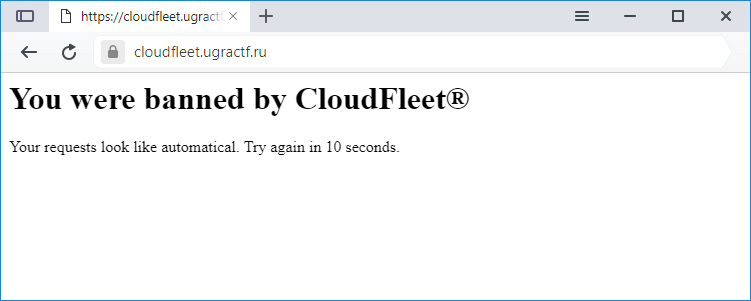

# CloudFleet: Write-up

Решаем таск **The book**, пытаемся применить ту же идею на Cloudfleet, но что-то идет не так.

Оказывается, после каждого третьего запроса мы получаем бан:

Опытным путем выясняем, что бан производится по IP-адресу. А, поскольку это категория `ppc`,
то поступим самым примитивным путем — наберем кучу публичных проксей, и начнем ходить через 
них.

Опять же, через некоторое время получаем флаг.

Флаг: **ugra_unb4n_my_1p_p13453**
